# BDD Process Flow Diagram

This diagram illustrates the principal scheme of the BDD process, with scenarios as the central artifact connecting requirements gathering and test generation.

```mermaid
flowchart LR
    %% Left side: Requirements to Scenarios
    subgraph Input["Requirements → Scenarios"]
        direction TB
        A[Business Requirements]
        B[User Stories]
        C[Acceptance Criteria]
        D[Edge Cases & Constraints]
        
        A --> B
        B --> C
        C --> D
    end
    
    %% Central element: Scenarios
    E[("🎯 Scenarios<br/>(Gherkin)")]
    
    %% Right side: Scenarios to Tests
    subgraph Output["Scenarios → E2E Tests"]
        direction TB
        F[E2E Test Generation]
        G[Test Implementation]
        H[Code Implementation]
        I[Verification & Review]
        
        F --> G
        G --> H
        H --> I
    end
    
    %% Connections
    Input --> E
    E --> Output
    
    %% Feedback loop
    I -.->|"Refinement & Updates"| E
    I -.->|"New Requirements"| Input
    
    %% Styling
    classDef central fill:#4CAF50,stroke:#2E7D32,stroke-width:4px,color:#fff
    classDef input fill:#2196F3,stroke:#1565C0,stroke-width:2px,color:#fff
    classDef output fill:#FF9800,stroke:#E65100,stroke-width:2px,color:#fff
    
    class E central
    class A,B,C,D input
    class F,G,H,I output
```

## Process Description

### Left Side: Requirements → Scenarios

1. **Business Requirements** - Initial product/feature requirements
2. **User Stories** - Structured descriptions of user needs
3. **Acceptance Criteria** - Specific conditions for feature completion
4. **Edge Cases & Constraints** - Additional scenarios and limitations

These inputs are consolidated and formalized into **Scenarios** written in Gherkin format.

### Center: Scenarios

Scenarios serve as the **single source of truth** that:
- Capture all business requirements in executable format
- Provide clear specifications for implementation
- Enable communication between business and technical teams
- Remain stable and manageable as the codebase scales

### Right Side: Scenarios → E2E Tests

1. **E2E Test Generation** - Automated generation of test code from scenarios
2. **Test Implementation** - Creation of actual test suites
3. **Code Implementation** - LLM generates code to satisfy failing tests
4. **Verification & Review** - Tests run and results are reviewed

### Feedback Loops

- **Refinement & Updates** (dashed line) - Test results may reveal missing scenarios or edge cases, updating the scenario file
- **New Requirements** (dashed line) - Discovered gaps may generate new requirements for future iterations

## Key Principles

- **Scenarios are central** - They bridge the gap between business requirements and technical implementation
- **One-way deterministic flow** - Each step is predictable and repeatable
- **Tests define done** - E2E tests provide objective completion criteria
- **Feedback improves quality** - Each iteration refines scenarios and templates

